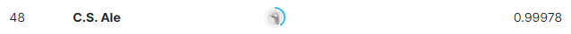

# MNIST Digit Recognizer

While this dataset is usually referred to as a toy example, and it most certainly is, I have included this project due to its performance. It achieved 48th place on the leaderboard as of the time of this README being created!

Beyond the fact that the performance of this model was good, I believe it contains good analysis and explaiinability!